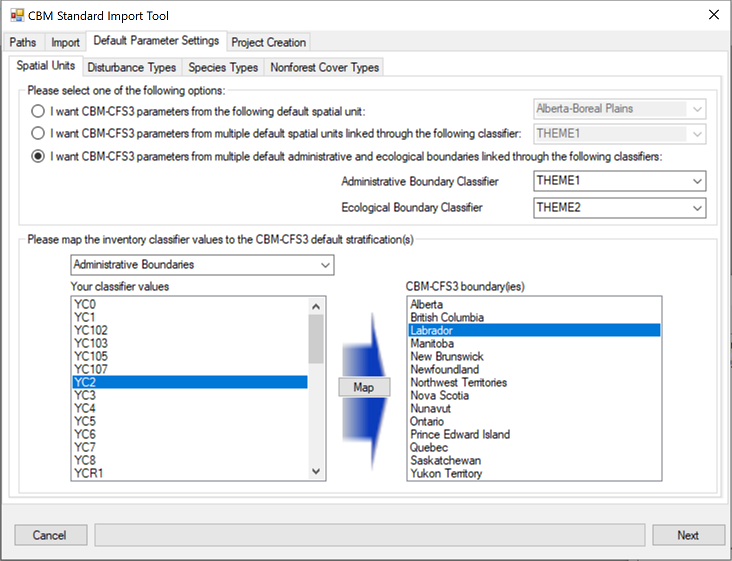
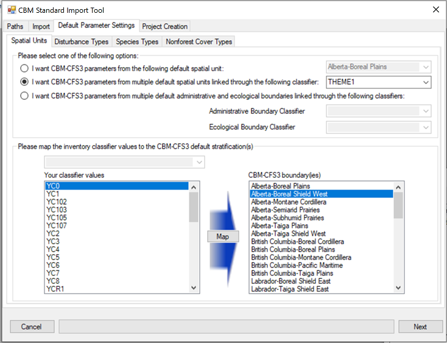
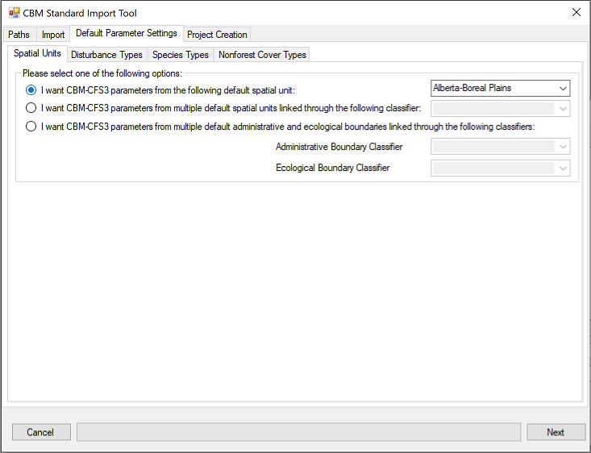

# CBM-CFS3 Standard import tool automation

The CBM-CFS3 standard import tool (SIT) can be run via the cbm3_python package via bundles command line tools or by calling cbm3_python as a library from a python script or jupyter notebook

## Running from the command line

The examples can be run using the cbm3_python built-in command `cbm3_sit_import`

The command's syntax is

```
cbm3_sit_import <sit_data_dir> <output_filename>
```

`output_filename` is the path to the CBM-CFS3 project Access database created by importing the SIT dataset.

`sit_data_dir` points to a directory with the following standardized files:

* mapping.json
* sit_classifiers.csv
* sit_disturbance_types.csv
* sit_age_classes.csv
* sit_inventory.csv
* sit_yield.csv
* sit_events.csv
* sit_transitions.csv

The csv files are in the tabular Standard import tool format which is described in chapter 3 of the [Operational-Scale CBM-CFS3 user guide](https://cfs.nrcan.gc.ca/pubwarehouse/pdfs/35717.pdf)

The format of mapping.json is described [here](https://github.com/cat-cfs/StandardImportToolPlugin/wiki/Configuration)

## Running as a library

The following python demonstrates importing an sit dataset into a CBM-CFS3 project Access database

The pair of required parameters are the same as those described in the *Running from the command line* section above.

```python
from cbm3_python.cbm3data import sit_helper

sit_helper.csv_import(
    csv_dir=sit_data_dir, 
    imported_project_path=cbm3_project_path)
```


## Initial set up steps

See the *requirements* section in the [docs](../../)

If cbm3_python is not already installed, it can be installed from this command:

```bash
pip install git+https://github.com/cat-cfs/cbm3_python
```


### Get the example files

Clone the repository to get a copy of the example files 

```bash
cd my_dir
git clone https://github.com/cat-cfs/cbm3_python
```

You now have a copy of cbm3_python sit_automation example files at `my_dir/cbm3_python/examples/sit_automation `


## Examples

### Administrative/Ecological classifier mapping

[/examples/admin_eco_classifier](./admin_eco_classifier) 

This example demonstrates a CBM3 SIT project which had data mappable to CBM3 Default administrative and ecological boundaries

Run from command line

```bash
cbm3_sit_import my_dir/cbm3_python/examples/sit_automation/admin_eco_classifier my_project.mdb
```

This example corresponds to the Standard import tool user interface in the following image.  Note the 3rd radio button is checked.



### Spatial Unit classifier mapping

[/examples/spatial_unit_classifier](./spatial_unit_classifier) 

This example demonstrates a CBM3 SIT project which had data mappable to CBM3 Default spatial unit

Run from command line

```bash
cbm3_sit_import my_dir/cbm3_python/examples/sit_automation/spatial_unit_classifier my_project.mdb
```

This example corresponds to the Standard import tool user interface in the following image.  Note the 2nd radio button is checked.



### No spatial unit classifier

[/examples/no_spatial_unit_classifier](./no_spatial_unit_classifier) 

This example demonstrates a CBM3 SIT project which is mapped to a single CBM3 Default spatial unit

Run from command line

```bash
cbm3_sit_import my_dir/cbm3_python/examples/sit_automation/no_spatial_unit_classifier my_project.mdb
```

This example corresponds to the Standard import tool user interface in the following image.  Note the 1st radio button is checked.


